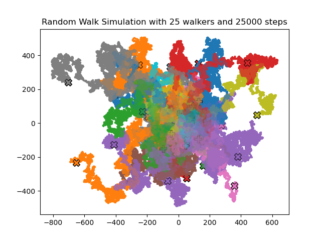
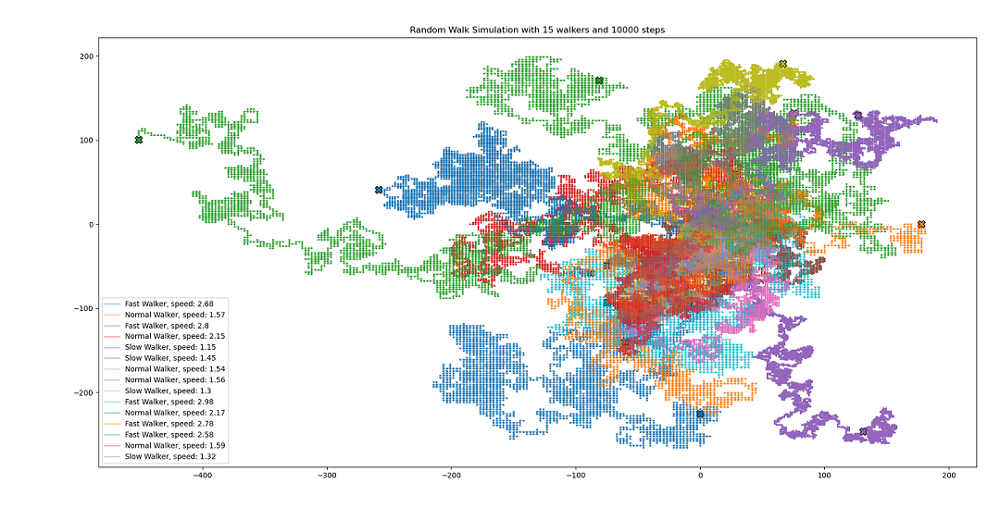
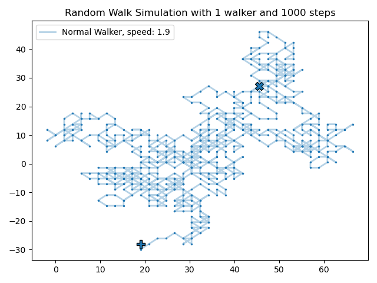

# Random Walk Simulation

In this project a simulation of randomized walks is generated.

## Description

A random walk is a mathematical object, known as a stochastic or random  process, that describes a path that consists of a succession of random  steps on some mathematical space such as the integers. An elementary example of a random walk is the random walk on the integer number line, which starts at 0 and at each step moves +1 or -1 with  equal probability ([Source](https://www.geeksforgeeks.org/random-walk-implementation-python/)).

This project aims to simulate a random walk simulation with different options and further implementations. The main implementations are:

1. The program can simulate **multiple random walkers** with different speeds
2. **High randomization** of speeds, start points, colorization etc.
3. The program has **options** to simulate the random walk of your needs like different neighborhood movement patterns (Neumann and Moore), enabling random start points, running the code multiple times, saving the plot automatically...
4. TBD: 3D walks

## Getting Started

To get started the dependecies, the location of the files and a short explanation of the code is given in the following subchapters.

### Dependencies

To run the program every machine having Python 3.9 installed is suitable. Your Python environment should additionally include the libraries numpy, matplotlib and pandas. The rest should be included in the python installation. If you are using Linux or Mac, you should check the relative paths beforehand.

### Installing

Our files are divided in six Python script files (*main.py*, *walkers.py*, *utils.py*. *test_objects.py*, *test_integration.py* and *init.py*). *main.py* is referring to the main program. *walkers.py* is creating a class Walkers with specified parameters for starting points on the x- and y-axis as well as speed. Furthermore, this parameters are checked and returned in a formatted string with details about the type of walker. *utils.py* provides some functions to plot the walkers and write them to a csv-file. The files *test_objects.py*, *test_integration.py* are testing whether the created functions are working and if the the main program is executing properly and catching any errors.

### Executing program

For the main script the following libraries should be imported:

```
from walkers import Walker
import utils
import sys
import os
import time
```

"From walkers import Walker" and "import utils" are referencing to our self-written modules which themselves in addition use following libraries:

```
import numpy as np
import matplotlib.pyplot as plt
import pandas as pd
```

The program is structured as explained below:

- variables for the number of walks and steps are defined (user-generated)
- the user can specify if a plot should be saved and how many times the code should be executed in total
- additionally the movement pattern can be chosen (4 or 8 directions)
- this leads to the definition of two arrays in form of x and y-coordinates with zeros..
- ..that are filled with random generated values through a for-loop for each walker
- the starting point in form of x and y can be randomized for each walk, otherwise all walkers start at 0,0
- the randomized choice of speed is implemented in the loop and is randomized for every walker
- with the definition of the class Walkers a detailed dataframe for every walk is generated which contains information about the type of walker, the starting point and the speed
- finally the dataframe is saved as a CSV-file and the walks are plotted together in one figure
- if the user specified that there should be multiple runs, this process is automatically repeated

Call the program without any arguments to access the help within the terminal with information on how to use the optional arguments:

```
$ python src/main.py

usage: main.py [-h] [-s Steps, integer] [-w Walkers, integer]
[-m Movepattern, bool] [-xy Startpoint, bool] [-p Save plot, bool]
[-r Runs, integer]

Simulate a random walk with n walkers for n steps. You can use the following options to change the simulation to your needs. Have fun!

optional arguments:
  -h, --help            show this help message and exit

  -s Steps, integer     Number of total steps every walker shall take.
                        Default value: 1000
  -w Walkers, integer   Number of total walkers to be created.
                        Default value: 1
  -m Movepattern, bool  Choose neighborhood movement pattern between
                        Neumann (4 directions, false) or
                        Moore (8 directions, true, default)
  -xy Startpoint, bool  Do you want different (random) start points for
                        each walker (true, default) or
                        let all plots start at 0,0 (false)?
  -p Save plot, bool    Do you want to automatically save the plot locally
                        (in ./data/)? Use true/false. Default: false
  -r Runs, integer      Total runs of the script (generate multiple plots if
                        wished). Default value: 1
```

## Results

Due to the high randomization of the simulation the following possible results are shown only exemplarily.

### Example 1
Options: 25 walkers, 25000 steps, default values except saving the plot

```
$ python src/main.py -s 25000 -w 25 -p true
```


### Example 2
Options: 15 walkers, 10000 steps, start point at 0,0, movement pattern Neumann and not saving the plot (was saved later on)
```
$ python src/main.py -s 10000 -w 15 -xy false -m false
```


### Example 3
With default values only
```
$ python src/main.py
...
You can run the program with the default values.
Want to run it now? Use y/n: y
```
